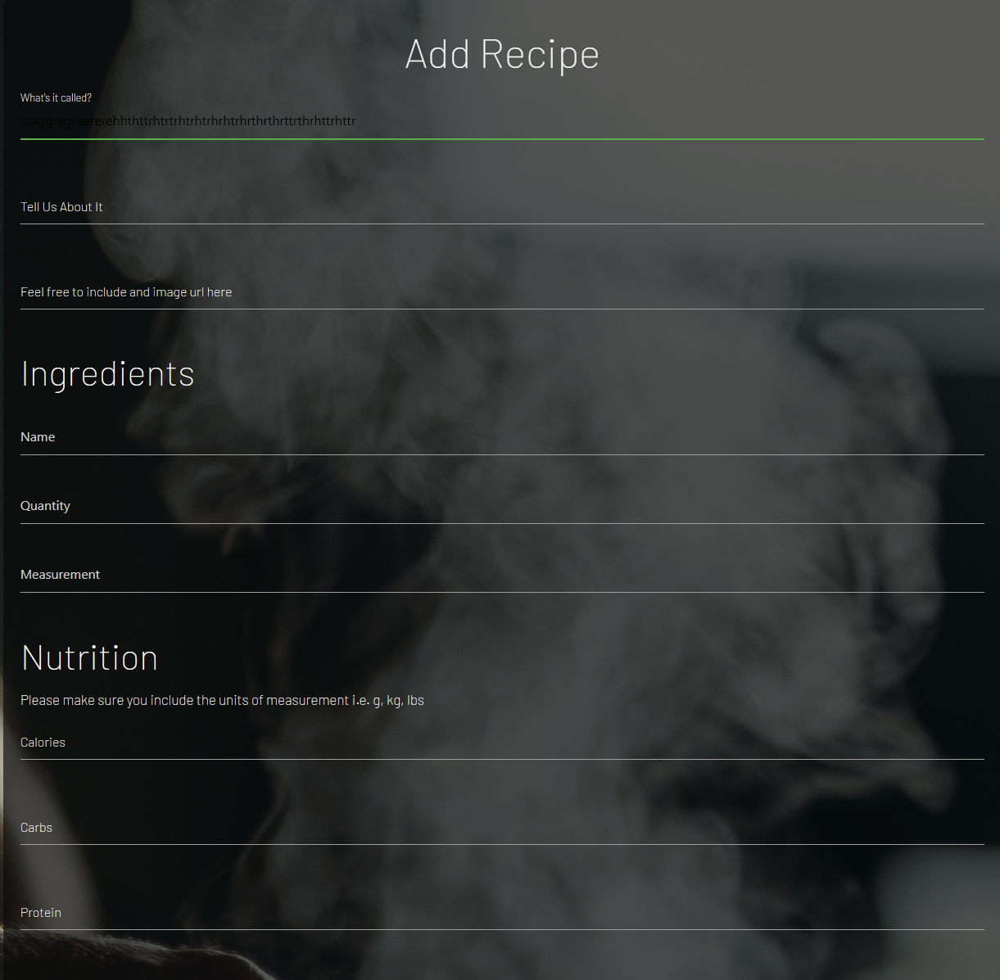

# Assessment Feedback and Resolutions
## 1.1 Bad UX design in forms.
Add Meal Before  | Add Meal After | Add Meal Form Guides Added |
:---------------: | :---------------: | :---------------: |
  |  | 

## Resolutions:
* CSS File updated with classes and font-styling to target the input id's for each field aswell as targeting input[type="text"]. This has also rectified the email address field in the register form to display correct text colour.
* Also updated Recipe form with a guide on input for each field
* Register buttons on Home and Who We Are pages updated with some CSS taken from the Login page to display same styling
* Servings entry not rendering when user adds value to the field, typo fixed to ```"servings": request.form.get("servings")``` as opposed to ```'steps'```.
* Image wasnt rendering when user updates recipe, syntax fixed. Value wasn't passed in to the url section therefore no data rendering back when form updated = ```value="{{ meal.url }}"```. Issue now rectified.
* Populated fields on a new meal entry were'nt rendering back to the page when user wants to edit their meal which resulted in bad UX, values passed back from MongoDB in jinja templating to rectify this issue. 
#
Edit Recipe Before  | After |
:---------------: | :---------------:
  |  |
#
## 1.1	Missing UX and/or issues in navigation
## Resolution
* URL for home page added to the company logo situated in the top right hand corner, checked navigation in nav links.
#
## 1.5 Fails to pass through the official validator, and has significant code issues in console and front-end
## Resolution
* Source code for all pages on site ran through validators, issues highlighted now resolved. Syntax amended.
#